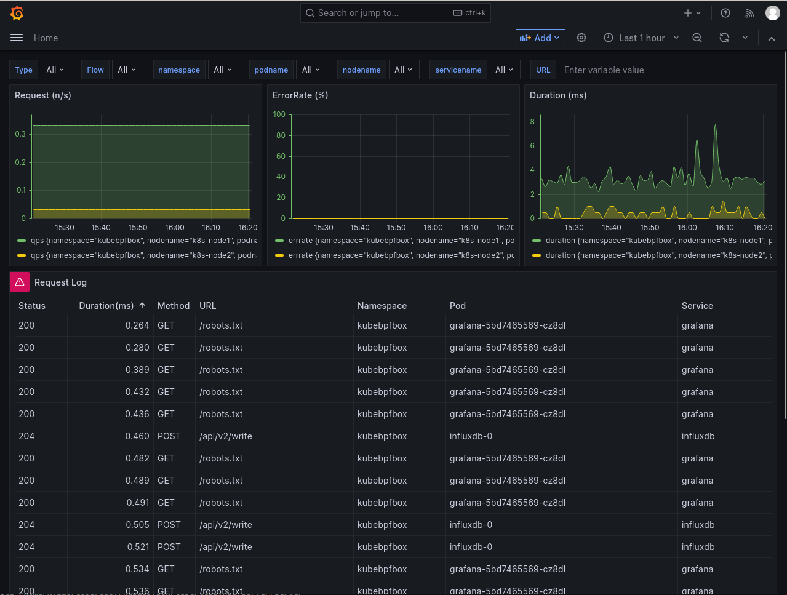
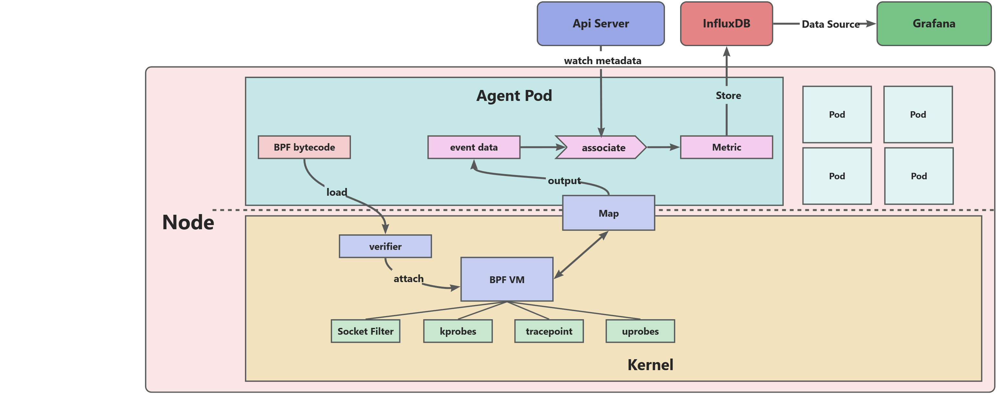

# kubebpfbox
A Kubernetes native observable application based on eBPF.

## 项目介绍
### 概要
kubebpfbox 是基于 ebpf 技术在 Kubernetes 环境中实践可观测性的项目，提供对上层业务零侵扰的方式采集业务调用日志、服务的 R.E.D 指标、OOM 事件日志、TCP Backlog 队列溢出事件日志等可观测性数据，采用 InfluxDB 对数据进行持久化，采用 Grafana 进行可视化，用于采集 ebpf 数据的 agent 支持扩展，方便开发自己的 ebpf 程序来采集需要的数据，并且可以将数据进行分析和可视化。



### 特性
目前支持的功能特性：  
- [x] HTTP 流量分析：基于经典的 `BPF_PROG_TYPE_SOCKET_FILTER` 类型分析每一次 HTTP 流量，并且和 Kubernetes 元数据进行关联，还原 Pod 之间的每一次 HTTP 请求和响应。  
- [x] R.E.D 指标统计：基于 Pod 的 HTTP 流量，统计每个 Pod 的 QPS、Error Rate、Duration等性能指标  
- [ ] OOM 事件日志：基于 Kprobe 内核态探针类型分析每一次 Out of Memory 事件，~~将被 kill 的进程的 pid 和 Kubernetes 元数据进行关联（未完成）~~，准确定位每次 OOM 事件发生的位置。  
- [ ] TCP Backlog 队列溢出事件日志：基于 Kprobe 内核态探针类型分析每一次 TCP Backlog 队列溢出事件，~~将发生溢出的进程的 pid 和 Kubernetes 元数据进行关联（未完成）~~，准确定位每次 TCP Backlog 队列溢出事件发生的位置及发生时的队列状态，包括队列当前值与队列上限。

## 基本结构
* agent 通过 daemonset 特权容器方式部署在每个节点上，管理 eBPF 程序的生命周期（加载、挂载、卸载），通过 Map 进行数据交互，将采集的同Kubernetes 集群的元数据关联分析后，写入 InfluxDB 中。
* InfluxDB 负责将收集的可观测性指标进行持久化存储。
* Grafana 通过仪表盘将数据可视化。



## 环境依赖
* Linux 内核版本 >= 5.8 (ringbuf 数据结构的支持)
* Kubernetes 版本 >= 1.16 (引入 Endpoint 切片)
* CNI 网络插件使用 Flannel（监听 cni0 网卡获取节点上所有Pod通信）

## 配置
Grafana 与 InfluxDB 均需要持久化存储，通过 `/scripts/config.ini` 配置存储位置，并创建出对应的目录，配置示例：
```ini
# vim configs/config.ini

[global]
NAMESPACE=kubebpfbox
[influxdb]
;influxdb requires persistent storage. please create a directory on the node
INFLUXDB_HOST=k8s-node1
INFLUXDB_PV_PATH=/data/pv-kubebpfbox-influxdb
[grafana]
;grafana requires persistent storage. please create a directory on the node
GRAFANA_HOST=k8s-node1
GRAFANA_PV_PATH=/data/pv-kubebpfbox-grafana
```
Agent 需要连接 Api Server 获取集群资源的变化，如果在集群外运行，需要集群的配置文件，Agent 相关配置示例：
```yaml
# vim configs/config.yaml

Cluster:
  ConfigPath: /root/.kube/config
  NetInterface: cni0
App:
  LogSavePath: logs
  LogFileName: agent
  LogFileExt: .log
```

## 安装
### 构建
首先，需要安装编译 ebpf 程序所依赖的工具和库：
```shell
yum update && yum -y install make glibc-devel.i686 elfutils-libelf-devel clang llvm tar git kernel-devel
```
克隆项目并构建
```shell
git clone https://github.com/kaohsiangyang/kubebpfbox.git
cd kubebpfbox
make build
```

### 打包
配置 docker push 的镜像地址
```shell
vim build/build.sh
```
执行镜像的构建与上传
```shell
make image
```

### 部署
执行安装脚本
```shell
sh scripts/install.sh
```
卸载
```shell
sh scripts/uninstall.sh
```

## 用法
Grafana 可视化服务通过集群的 Ingress 暴露给外部访问，将 `grafana.kubebpfbox.com` 主机名解析到集群IP，即可通过 `http://grafana.kubebpfbox.com:port/` 访问可视化面板。（`port` 与 Ingress-controller 的服务配置有关）  
初始登录的账号和密码均为 `admin`。

## 限制

### HTTP 流量分析
在内核空间进行完善的 HTTP 流量分析面临很多难点，目前本项目只实现了 HTTP/1.1 最基本的请求-响应模式。
* 不支持 pipeline 机制。  
* HTTPs 流量的解析需要使用用户空间追踪（Uprobe 或 USDT）捕获 SSL/TLS 加密信息，当前不支持。  
* HTTP/2 的二进制分帧、头部压缩、多路复用等新特性都对连接的跟踪和报文的解析带来了很多难点，当前不支持。  
* 基于 HTTP 的各种协议如 gRPC、WebSocket 等也均不支持。

### OOM 事件日志
在内核中跟踪到 OOM 事件后需要在用户空间根据进程的 pid 关联对应的 pod，但是此时因为进程已经被 kill，无法通过 /proc 文件系统得到进程对应的 Pod UID，则无法关联到 Kubernetes 元数据。

### TCP Backlog 队列溢出事件日志
在内核中跟踪到 TCP Backlog 队列溢出事件后同样需要通过 pid 关联对应的 pod，但此时面临的问题是，触发内核对应事件的函数执行时 CPU 上正在运行的进程并非 listen 套接字所属的进程，只能通过 sock->socket->file->f_owner->pid 获取真正的 pid，但是此 pid 只有在用户空间程序主动调用 `fcntl(F_SETOWN)` 命令设置套接字信号的接收者，而且 Pod 中的进程通过 `getpid()` 获取的进程是其所在 pid namespace 视图下的 pid，与根 pid namespace 并不一致，因此，无法通过 /proc 文件系统得到进程对应的 Pod UID，则无法关联到 Kubernetes 元数据。

## 开发
agent的设计采用了插件化的架构，参考了 telegraf 项目，在agent启动的时候启动注册的所有插件，然后所有的插件将采集的数据写入到一个channel中，最终消费这个channel将数据发送到外部服务或者存储中。

开发自己的 ebpf 插件采集内核信息，分为两部分：ebpf 内核空间程序与用户空间程序。
* 内核空间程序采用 C 的子集开发，位于 `ebpf/plugin-name`；
* 用户空间程序采用 Go 语言开发，基于 `cilium-ebpf` 库读取、修改和加载 eBPF 程序，位于 `plugins/plugin-name`；  

插件通过 `init` 函数注册插件，将在包导入时执行注册，通过 `Gather` 函数收集指标数据。

## 文档

* HTTP 流量分析 [设计文档](./docs/http.md)
* OOM 事件日志 [设计文档](./docs/oomkill.md)
* TCP Backlog 队列溢出事件日志 [设计文档](./docs/tcpsynbl.md)

## 鸣谢

- [ebpf](https://ebpf.io/) a revolutionary Linux kernel technology.
- [cilium-ebpf](https://github.com/cilium/ebpf) a pure-Go library to read, modify and load eBPF programs and attach them to various hooks in the Linux kernel.
- [bcc](https://github.com/iovisor/bcc) Tools for BPF-based Linux IO analysis, networking, monitoring, and more
- [cilium](https://github.com/cilium/cilium) eBPF-based Networking, Security, and Observability.
- [influxdb](https://github.com/influxdata/influxdb) Scalable datastore for metrics, events, and real-time analytics.
- [grafana](https://github.com/grafana/grafana) The open and composable observability and data visualization platform.
- [telegraf](https://github.com/influxdata/telegraf) The plugin-driven server agent for collecting & reporting metrics.
- [owlk8s](https://github.com/est357/owlk8s) A K8s ClusterIP HTTP monitoring library based on eBPF.

## 版权信息
Kubebpfbox 遵循 MIT 许可证。有关详细信息请参见 LICENSE 文件。
