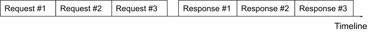
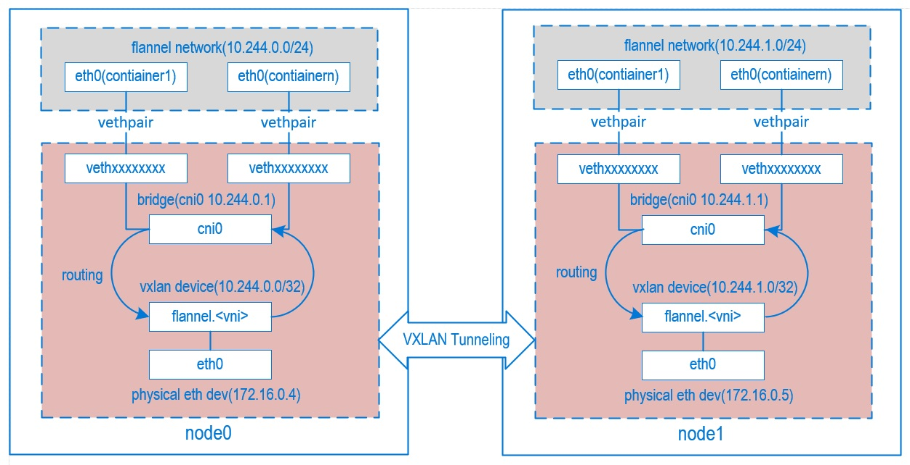

## 背景
HTTP 流量的分析对于服务状态的监控具有重要意义，一般通过访问日志、服务网格等方式实现，相比而言，使用 eBPF 技术在内核态跟踪分析 HTTP 流量具有性能高、无侵入性等特点。

## HTTP 流量分析

### 协议识别

在 HTTP/1.x 中，数据的头部为纯文本内容，通过将 TCP 数据包的 payload 的文本化，解析其中的字符确定数据包属于请求还是响应：
```
Request line:
[Method] [URL] [Protocol version]

Status line:
[Protocol version] [Status code] [Description]
```

### 请求-响应匹配

HTTP pipeline 是 HTTP/1.1 的一项功能，它允许通过单个 TCP 连接发送多个 HTTP 请求，而无需等待相应的响应。由于缺少流标识符，对于服务器端来说响应顺序与请求的顺序匹配。

例如：HTTP 客户端向服务器发送多个请求，服务器通过按与请求相同的顺序发送 HTTP 响应来响应。这意味着客户端发送的第一个请求将收到来自服务器的第一个响应，第二个请求将接收第二个响应，依此类推。



在设计 HTTP 请求与响应匹配时，可以依据此原则，以 TCP 连接的四元组作为键，将请求数据保存到队列中，在解析响应时删除第一项，保证正确的请求-响应匹配。

### 指标
通过解析 HTTP 流量数据，并匹配请求-响应，还原一次完整的访问链路，生成访问 R.E.D 指标。
* Rate（访问速率）
* Errors（错误）
* Duration（响应时长）

## Map 数据交互

eBPF 程序通过 map 与用户态程序进行数据交互：
* 用户态程序需要将本节点上需要跟踪的 Endpoint IP 写入 map，eBPF 只过滤出 map 中 IP 相关的流量。
* eBPF 程序还原访问之后，将采集的指标（源 IP、源 Port、目的 IP、目的 Port、请求方法、URL、状态码、响应时间）发送到用户空间。

对于将 eBPF 采集到的指标数据从内核空间发送到用户空间，使用 ringbuf 类型的 map 是最高效的，ringbuf 是内核 5.8 引入的新的 map 类型，既提供了与 perf events 缓冲区相似的功能和性能，同时解决了 perf events 缓冲区内存效率和事件重新排序的问题，且 cilium-ebpf 库提供了对 ringbuf 很好的支持。

## k8s 元数据关联

使用 eBPF 从 TCP 流中还原出访问日志并发送给用户空间之后，需要将访问日志同 k8s 的 Service 和 Pod 关联起来。

### k8s 元数据
通过 k8s 提供的 watch 机制，watch 集群中的 endpoints 资源，其中包含了提供某一服务的 Pod 的 IP 和 Port。

一种关联方法是通过 Pod 在宿主机上的 veth 网络接口，为每一个 Pod 创建一个独立的 eBPF 程序，该 eBPF 程序所抓取的数据包一定属于该 Pod，从而实现了数据包跟k8s元数据的关联。

但是这种方式需要创建和管理大量的 eBPF 程序，对程序设计和系统性能都产生影响。

### k8s Flannel 网络插件模型
经过对 k8s 网络模型的分析，对于使用 Flannel 网络插件下的 Overlay 网络，其通信模型如下：
* 当前节点的所有 Pod 通过各自的 veth pair 连接到 cni0 网桥上，此时使用同节点的 Pod 通信直接根据 Pod IP 完成转发；
* 跨节点的 Pod 通信根据路由规则交给 flannel.l 接口进行处理，将包封装成 vxlan udp 数据包之后交给 eth0 网卡理解宿主机节点；
* vxlan udp 数据包 正确路由到目标 Pod 所在的节点；
* 经由 flannel.1 接口解包得到 Pod IP，命中路由规则，交给 cni0；
* cni0 将数据包送到目标 Pod。



### 通过 IP:Port 进行数据关联
基于 Flannel 网络插件的通信模型，为了跟踪本节点上 Pod 所有 HTTP 通信，只需要为 cni0 网卡创建一个 eBPF 程序，即可跟踪本节点上所有的 Pod 通信。

对于每一次访问，可以通过 IP:Port 匹配对应的 Service 及 Pod。

但是对于 hostnetwork 类型的 Pod，其使用了宿主机的网卡，所以无法通过 cni0 网卡跟踪 HTTP 流量。