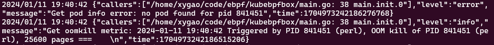

## 背景
当操作系统内存不足时，OOM Killer 将会通过算法选择某一进程杀掉，在云原生场景下，通过 cgroup 控制容器的资源使用量，当容器使用的资源超出限制时，也会触发 OOM kill 事件，因此监控 OOM 事件对保证服务的可用性有很大意义。

传统的 OOM kill 事件监控通过监控 /dev/kmsg 系统日志中 oom-kill 信息实现的，这种方式需要有专门的工具持续监控 /dev/kmsg 文件内容，解析事件。

eBPF程序可以通过跟踪内核中处理 OOM kill 事件的函数获得对应的信息。

## 收集 OOM kill 事件
利用 eBPF 的 kprobes 内核空间探针，可以在几乎任何内核函数的入口和返回处捕获，执行对应的 eBPF 程序。

`oom_kill_process` 是内核中处理 OOM 事件的函数，其原型如下：
```C
static void oom_kill_process(struct oom_control *oc, const char *message)
```

通过将 kprobe 程序挂载在该函数处，即可在 OOM kill 事件处理的第一现场收集信息。

其中的 `struct oom_control` 提供了 memory cgroup、使用的总页数、需要 kill 的 task 等等重要信息，通过解析函数参数即可获取相关信息。
```C
struct oom_control {
	struct zonelist *zonelist;
	nodemask_t *nodemask;
	struct mem_cgroup *memcg;
	const gfp_t gfp_mask;
	const int order;
	long unsigned int totalpages;
	struct task_struct *chosen;
	long int chosen_points;
	struct mem_cgroup *reset_list;
	int num_skip;
	bool use_priority_oom;
	enum oom_constraint constraint;
};
```

## kprobes 程序依赖内核源码
kprobes 程序用于跟踪内核函数的执行状态，可以挂载在几乎所有内核函数的入口或返回处，获取参数和返回值，因此必然会依赖于特定内核中的数据结构。

由于内核版本的差异，内核结构体和函数签名可能会发生变化，在当前运行内核上构建的 eBPF 程序在另一台不同内核版本的机器上运行时，可能会失败。

`vmlinux.h` 是使用工具生成的代码文件。它包含了系统运行 Linux 内核源代码中使用的所有类型定义。可以使用 bpftool 工具生成当前运行内核的 `vmlinux.h` 文件。

只包含 `vmlinux.h` 头文件编译 eBPF 程序，就可以避免依赖整个内核源码树，同时实现“CO:RE”（一次编译，到处运行），libbpf 库还定义了部分宏（比如 BPF_CORE_READ），辅助找到内核数据结构中特定字段是否存在及其偏移。

## 关联 k8s 信息

通过需要 kill 的 task 的 pid，关联其所在 Pod 信息，才能准确定位发生事件的位置。

要获取进程所在的 Pod，可以通过 /proc/pid/cgroup 文件查看其所属的 cgroup 组，其中包含了 Pod UID 和 Container ID。

cgroup 的路径因 Kubernetes版本、所使用的 cgroup 驱动、容器运行时等有所差异，以测试平台为例：
```
# cat /proc/14880/cgroup
12:blkio:/kubepods.slice/kubepods-burstable.slice/kubepods-burstable-pod1d4361ce_e21a_4548_bc40_b1f57db309e0.slice/cri-containerd-8209b1fcf9524a53cd600c6fd463ff1c50f078ecd426bc7da68de8fda2d6eab8.scope
11:pids:/kubepods.slice/kubepods-burstable.slice/kubepods-burstable-pod1d4361ce_e21a_4548_bc40_b1f57db309e0.slice/cri-containerd-8209b1fcf9524a53cd600c6fd463ff1c50f078ecd426bc7da68de8fda2d6eab8.scope
10:memory:/kubepods.slice/kubepods-burstable.slice/kubepods-burstable-pod1d4361ce_e21a_4548_bc40_b1f57db309e0.slice/cri-containerd-8209b1fcf9524a53cd600c6fd463ff1c50f078ecd426bc7da68de8fda2d6eab8.scope
9:devices:/kubepods.slice/kubepods-burstable.slice/kubepods-burstable-pod1d4361ce_e21a_4548_bc40_b1f57db309e0.slice/cri-containerd-8209b1fcf9524a53cd600c6fd463ff1c50f078ecd426bc7da68de8fda2d6eab8.scope
8:cpuset:/kubepods.slice/kubepods-burstable.slice/kubepods-burstable-pod1d4361ce_e21a_4548_bc40_b1f57db309e0.slice/cri-containerd-8209b1fcf9524a53cd600c6fd463ff1c50f078ecd426bc7da68de8fda2d6eab8.scope
7:rdma:/kubepods.slice/kubepods-burstable.slice/kubepods-burstable-pod1d4361ce_e21a_4548_bc40_b1f57db309e0.slice/cri-containerd-8209b1fcf9524a53cd600c6fd463ff1c50f078ecd426bc7da68de8fda2d6eab8.scope
6:perf_event:/kubepods.slice/kubepods-burstable.slice/kubepods-burstable-pod1d4361ce_e21a_4548_bc40_b1f57db309e0.slice/cri-containerd-8209b1fcf9524a53cd600c6fd463ff1c50f078ecd426bc7da68de8fda2d6eab8.scope
5:cpu,cpuacct:/kubepods.slice/kubepods-burstable.slice/kubepods-burstable-pod1d4361ce_e21a_4548_bc40_b1f57db309e0.slice/cri-containerd-8209b1fcf9524a53cd600c6fd463ff1c50f078ecd426bc7da68de8fda2d6eab8.scope
4:freezer:/kubepods.slice/kubepods-burstable.slice/kubepods-burstable-pod1d4361ce_e21a_4548_bc40_b1f57db309e0.slice/cri-containerd-8209b1fcf9524a53cd600c6fd463ff1c50f078ecd426bc7da68de8fda2d6eab8.scope
3:net_cls,net_prio:/kubepods.slice/kubepods-burstable.slice/kubepods-burstable-pod1d4361ce_e21a_4548_bc40_b1f57db309e0.slice/cri-containerd-8209b1fcf9524a53cd600c6fd463ff1c50f078ecd426bc7da68de8fda2d6eab8.scope
2:hugetlb:/kubepods.slice/kubepods-burstable.slice/kubepods-burstable-pod1d4361ce_e21a_4548_bc40_b1f57db309e0.slice/cri-containerd-8209b1fcf9524a53cd600c6fd463ff1c50f078ecd426bc7da68de8fda2d6eab8.scope
1:name=systemd:/kubepods.slice/kubepods-burstable.slice/kubepods-burstable-pod1d4361ce_e21a_4548_bc40_b1f57db309e0.slice/cri-containerd-8209b1fcf9524a53cd600c6fd463ff1c50f078ecd426bc7da68de8fda2d6eab8.scope
```
其中包含了 36 位的 Pod UID 和 64 位的 container ID。

使用正则表达式解析之后，通过 k8s 的 API 接口即可获取 Pod UID 所对应的 Pod 的详细信息。

## 遇到的问题
当内核触发 OOM kill 事件后，eBPF 程序采集事件信息，发送回用户空间，再查找 Pod 信息，但是此时进程已经被 kill，所以无法通过 /proc/pid 查找其所在的 Pod。

