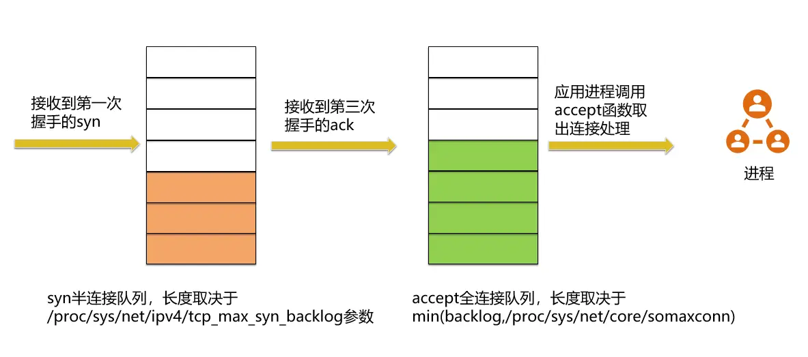
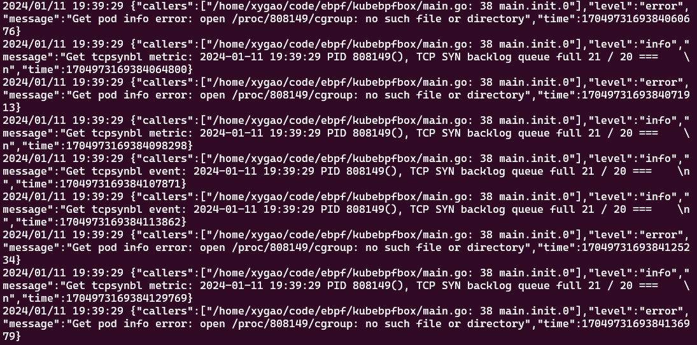

## 背景
TCP 在三次握手过程中内核会维护两个队列：半连接队列与全连接队列，全连接队列的长度取决于 `min(backlog, /proc/sys/net/core/somaxconn)`，当三次握手完成时，如果全连接队列已满，则可能会丢弃收到的第三次握手 ack，或发送 reset 重置连接。



当出现 TCP backlog 队列溢出时，说明此时收到的连接过多，服务无法即使响应，可能会影响用户体验，因此监控 TCP backlog 队列溢出事件对于优化服务质量有重要意义。

eBPF 程序可以通过跟踪 TCP 握手完成时的处理函数获取对应的信息。

## 收集 TCP backlog 队列溢出事件
同样利用 eBPF 的 kprobes 内核空间探针。

`tcp_v4_syn_recv_sock` 与 `tcp_v6_syn_recv_sock` 函数用于三次握手的最后一个 ACK 到达时服务器的处理，当全连接队列未满时，为新连接创建一个传输控制块，并初始化传输控制快。其原型如下：

```C
struct sock *tcp_v4_syn_recv_sock(struct sock *sk, struct sk_buff *skb, struct request_sock *req, struct dst_entry *dst)
```

通过将 kprobe 程序挂载在该函数处，即可在三次握手完成时及时收集信息。

其中 `struct sock` 是 listen sock，其中包含了众多 TCP 连接相关的状态和属性，包括：ack backlog 队列的最大限制、ack backlog 队列的当前值等。

## 关联 k8s 信息
与 oom kill 事件跟踪一样，需要通过 pid 关联其所在 Pod 信息，才能准确定位发生事件的位置。

## 遇到的问题
此时面临的最大的困难在于得到监听套接字所属的进程 pid。

首先，通过 eBPF 辅助函数 `bpf_get_current_pid_tgid()` 获取的 pid 是当前 CPU 所运行的进程，因为 TCP 网络数据包的处理路径通过中断机制，此时 CPU 运行的进程并非 listen 套接字所属的进程。

通过内核数据结构的梳理，`sock->socket->file->f_owner->pid` 是一种看似可行的方式用于获取 listen 套接字所属的进程 pid，但是 `f_owner` 用于设置套接字信号的接收者，只有在用户进程使用 `fcntl(sock, F_SETOWN, getpid())` 主动设置时才有效。

除了这个限制之外，这个方法在容器环境中还存在问题，每个容器拥有自己的 pid namespace，使用 `getpid()` 获取的 pid 并非 root namespace 视图下的 pid，通过此 pid 无法在宿主机的 /proc 文件系统中查看其信息。

